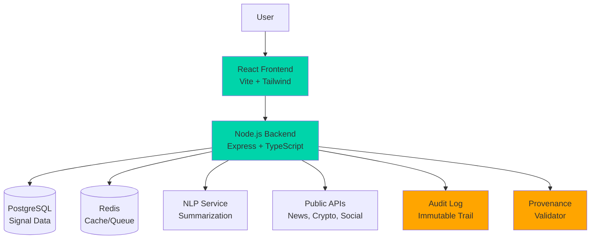

# BLACK GPT - Signal Intelligence Platform

[]()
[]()
[]()

**⚠️ CRITICAL COMPLIANCE NOTICE**

This application processes ONLY legal, auditable data sources. It does NOT and MUST NOT access:
- Tor network or .onion domains
- Dark web marketplaces or hidden services  
- Any illegal or illicit content sources
- Unauthorized data scraping

See [legal_sources.md](./legal_sources.md) for approved data sources and compliance guidelines.

---

## Overview

BLACK GPT is a production-ready full-stack application for collecting, summarizing, and verifying "hidden market signals" from legal public sources. It provides:

- 🔒 **Legal Compliance**: Only processes auditable, legal data sources
- 👤 **Human-in-the-Loop**: Mandatory verification workflow
- 🔍 **Public Correlation**: Cross-references signals with public web data
- 📋 **Audit Trail**: Immutable logging of all actions
- 🎨 **Black Theme UI**: Minimal, accessible interface
- 🚀 **Production Ready**: Docker, CI/CD, tests included

## Architecture



## Tech Stack

### Frontend
- **React 18** with TypeScript
- **Vite** for fast development
- **Tailwind CSS** for styling (black theme)
- **Axios** for API calls

### Backend
- **Node.js 18+** with TypeScript
- **Express** web framework
- **Prisma ORM** with PostgreSQL
- **Redis** for caching and queues
- **Winston** for logging

### Infrastructure
- **Docker** & Docker Compose
- **PostgreSQL 15** database
- **Redis 7** cache
- **Nginx** reverse proxy

## Quick Start

### Prerequisites

- Node.js 18+ and npm
- Docker and Docker Compose
- Git

### 1. Clone Repository

```bash
git clone https://github.com/rishabhrocktheparty-ai/Blackgpt.git
cd Blackgpt
```

### 2. Environment Setup

```bash
cp .env.example .env
# Edit .env with your configuration (API keys optional for demo mode)
```

### 3. Run with Docker Compose

```bash
# Start all services (database, redis, backend, frontend)
docker-compose up -d

# View logs
docker-compose logs -f

# Stop services
docker-compose down
```

The application will be available at:
- **Frontend**: http://localhost:5173
- **Backend API**: http://localhost:3000
- **API Docs**: http://localhost:3000/api/v1

### 4. Alternative: Local Development

#### Backend

```bash
cd backend
npm install
npm run dev
```

#### Frontend

```bash
cd frontend
npm install
npm run dev
```

#### Database Setup

```bash
# Run migrations
cd prisma
npx prisma migrate dev

# (Optional) Open Prisma Studio
npx prisma studio
```

## Features

### 1. Signal Creation
- Manual upload with script name and date range
- Multiple source types (Reddit, Twitter, News, Blockchain, etc.)
- Automatic provenance validation

### 2. Dark-Signal Gist Display
- Clean, readable gist panel
- Provenance tags, confidence score, and status indicators
- "Requires Attention" flags for suspicious content

### 3. Human Verification Workflow
- Accept, Reject, or Flag for Follow-up
- Add verification notes
- Immutable audit trail

### 4. Public Web Correlation
- One-click "Re-search Public Web" button (fixed bottom-right)
- Queries legal public APIs only:
  - NewsAPI for news articles
  - CoinGecko for crypto data
  - Reddit API (with proper auth)
- Generates correlation confidence score

### 5. Audit Log
- Immutable timeline of all actions
- Actor tracking with timestamps
- Full provenance chain

## API Endpoints

### Signals

```
POST   /api/v1/signals/upload           Create new signal
GET    /api/v1/signals/:id              Get signal by ID
GET    /api/v1/signals                  List signals (with filters)
POST   /api/v1/signals/:id/verify       Verify signal (accept/reject)
POST   /api/v1/signals/:id/research-public  Trigger correlation
GET    /api/v1/signals/:id/audit        Get audit log
```

### Request Examples

#### Create Signal

```bash
curl -X POST http://localhost:3000/api/v1/signals/upload \
  -H "Content-Type: application/json" \
  -d '{
    "scriptName": "BTC Trading Signal",
    "dateFrom": "2024-01-01T00:00:00Z",
    "dateTo": "2024-01-07T23:59:59Z",
    "gistText": "Increased trading volume detected...",
    "provenanceTags": ["manual", "crypto"],
    "sourceType": "MANUAL_UPLOAD",
    "uploaderUserId": 1
  }'
```

#### Verify Signal

```bash
curl -X POST http://localhost:3000/api/v1/signals/1/verify \
  -H "Content-Type: application/json" \
  -d '{
    "reviewerId": 1,
    "action": "accept",
    "notes": "Verified as legitimate signal"
  }'
```

## Testing

### Unit Tests

```bash
cd backend
npm test
```

### E2E Tests (Playwright)

```bash
cd tests/e2e
npm install
npm test
```

## Helper Scripts

### Generate Demo Signal

```bash
# Generate with default data
node scripts/generate-signal.js

# Generate from file
node scripts/generate-signal.js --from-file scripts/demo.txt
```

This script:
1. Creates a demo signal
2. Triggers public web correlation
3. Outputs the signal ID for testing

## Security & Compliance

### Provenance Validation
All signals are validated against disallowed patterns:
- Tor/.onion references
- Dark web marketplace mentions
- Illegal activity instructions
- Malware/exploit references

### Audit Logging
Every action is logged:
- Signal creation
- Verification decisions
- Correlation jobs
- Status changes

### Rate Limiting
- 100 requests per 15 minutes per IP
- Configurable via environment variables

### Data Retention
- Signals: 90 days (configurable)
- Audit logs: 2 years minimum
- Deleted content: Metadata only

## Deployment

### Docker Production Build

```bash
# Build images
docker-compose build

# Push to registry
docker tag blackgpt-backend:latest your-registry/blackgpt-backend:latest
docker push your-registry/blackgpt-backend:latest

docker tag blackgpt-frontend:latest your-registry/blackgpt-frontend:latest  
docker push your-registry/blackgpt-frontend:latest
```

### Kubernetes Deployment

```bash
kubectl apply -f k8s/namespace.yaml
kubectl apply -f k8s/database.yaml
kubectl apply -f k8s/backend.yaml
kubectl apply -f k8s/frontend.yaml
kubectl apply -f k8s/ingress.yaml
```

### Environment Variables

See `.env.example` for all configuration options:

- `DATABASE_URL`: PostgreSQL connection string
- `REDIS_URL`: Redis connection string
- `JWT_SECRET`: Secret for JWT tokens
- `NEWS_API_KEY`: NewsAPI key (optional in demo mode)
- `DEMO_MODE`: Enable/disable demo mode with canned responses

## UI Design

### Color Palette
- **Background**: Pure black (#000000)
- **Cards**: #0a0a0a with subtle borders
- **Accent**: Teal (#00d4aa) and Amber (#ffa500)
- **Text**: White primary, gray secondary

### Typography
- **Headlines**: 22-28px, bold
- **Gist Body**: 18px, readable line height
- **Metadata**: 14-16px

### Accessibility
- WCAG AA compliant contrast ratios (>4.5:1)
- Keyboard navigable
- Screen reader friendly

## Legal & Compliance Notes

### Allowed Data Sources
1. **Public Forums**: Reddit, Stack Exchange (via official APIs)
2. **News**: NewsAPI, Google News
3. **Social**: Twitter/X (with proper auth)
4. **Financial**: CoinGecko, Alpha Vantage, exchange APIs
5. **Blockchain**: Public explorers (Etherscan, Blockchain.com)
6. **Manual**: User uploads with provenance

### Prohibited Sources
- ❌ Tor/.onion networks
- ❌ Dark web marketplaces
- ❌ Illicit content aggregators
- ❌ Unauthorized scraping
- ❌ Stolen data sources

### Response Process for Suspicious Content
1. Signal automatically flagged
2. Admin notified via alerts
3. Human review within 24 hours
4. If illegal: Delete, log, consider reporting
5. Update detection rules

## Contributing

This is a proprietary project. For internal contributions:

1. Create feature branch
2. Make changes with tests
3. Run linters: `npm run lint`
4. Submit PR with description
5. Require 2 approvals + security review

## License

PROPRIETARY - All rights reserved.

## Support

For issues or questions:
- **Security**: security@company.com
- **Technical**: support@company.com
- **Compliance**: legal@company.com

---

**Built with ❤️ and ⚖️ Legal Compliance**